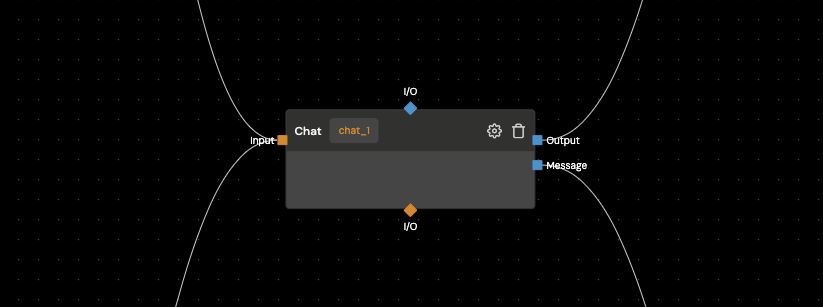

Large Language Model chat block enabling advanced conversational interactions powered by **OpenAI's** cutting-edge language models.

## Settings

In order to go to block's settings, you need to simply click settings icon

### Properties

#### Name

This is a name of chat. You can name it whatever you want but remember to use underscore (`_`) instead of space. Also doesn't matter if you'll write it lowercase, uppercase or normal case.

:::tip
Example: MY_CUSTOM_NAME, my_custom_name
:::
