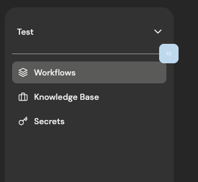
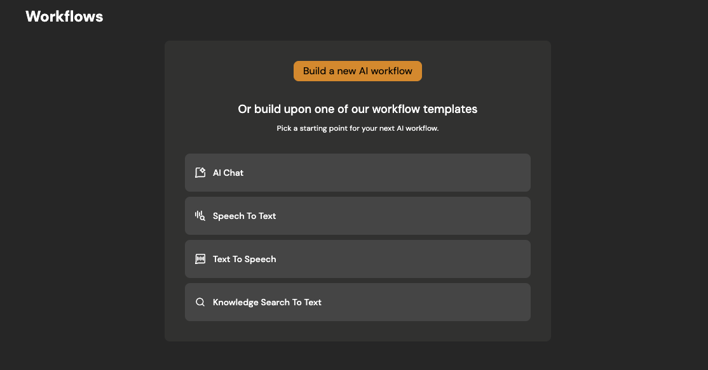

# Create first workflow

Learn how to work with workflows

## Prerequisites

To create workflows, you must first have an organization set up in Buildel. If you haven't created one yet, please refer to our [previous guide](01-first-organization.mdx) on how to do so.

## Create a new workflow

### Go to workflows page

### Initiate new workflow

Now you have option to either create workflow from one of templates or create new workflow from scratch. For this tutorial we will create new workflow from scratch.

