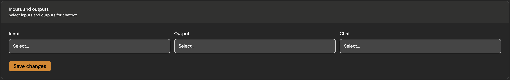

import Tabs from "@theme/Tabs";
import TabItem from "@theme/TabItem";

<Tabs>
  <TabItem value="sdk" label="Client SDK">
    ## Installation
      Begin by installing the necessary Buildel packages using package manager of your choice.

      This initial step equips you with the tools required for seamless integration with our API.
    <Tabs>
      <TabItem value="npm">
          ```bash title="~ terminal"
          npm install @buildel/buildel @buildel/buildel-auth
          ```
      </TabItem>
      <TabItem value="yarn">
          ```bash
          yarn add @buildel/buildel @buildel/buildel-auth
          ```
      </TabItem>
      <TabItem value="pnpm">
          ```bash
          pnpm install @buildel/buildel @buildel/buildel-auth
          ```
      </TabItem>
    </Tabs>
      ---

      ## Server-side configuration
      <Tabs>
          <TabItem value='nextjs' label='Next.js'>
              ```tsx title="index.tsx"
              import { BuildelAuth } from "@buildel/buildel-auth";

              export async function POST(request: Request) {
                const { socket_id: socketId, channel_name: channelName } = await request.json();

                const buildelAuth = new BuildelAuth(process.env.BUILDEL_API_KEY);

                const authData = buildelAuth.generateAuth(socketId, channelName);

                return NextResponse.json(authData);
              }
              ```
          </TabItem>
          <TabItem value='remix' label='Remix'>
              ```tsx title="index.tsx"
              import { BuildelAuth } from "@buildel/buildel-auth"

              export async function action({ request }: ActionFunctionArgs) {
                  const body = await request.formData();
                  const socketId = body.get("socketId") as string;
                  const channelName = body.get("channelName") as string;
                  const buildelAuth = new BuildelAuth(process.env.BUILDEL_API_KEY);
                  const authData = buildelAuth.generateAuth(socketId, channelName);
                  return json({ authData });
              }
              ```
          </TabItem>
      </Tabs>
      ---

      ## Initialize client SDK
      ```tsx title="BuildelSocket.tsx" {4-6}
      export const BuildelProvider = ({ children }: PropsWithChildren) => {
        useEffect(() => {
            async function connect() {
                const organizationId = 27;
                const authUrl = "/buildel/auth";
                const buildel = new BuildelSocket(organizationId, { authUrl });
            }
        }, [])
      }
      ```
      ---

      ## Connect websockets

      Establish a connection to our websocket server to engage in real-time bidirectional communication. This connection is vital for real-time messaging and data interchange.

      ```tsx title="BuildelSocket.tsx" {8-10}
      export const BuildelProvider = ({ children }: PropsWithChildren) => {
          const [buildel, setBuildel] = useState<BuildelSocket | null>(null);

          useEffect(() => {
              const connect = async () => {
                  const organizationId = 27;
                  const authUrl = "/buildel/auth";
                  const buildel = new BuildelSocket(organizationId, { authUrl });

                  await buildel.connect();

                  setBuildel(buildel);
              }

              connect();

              return () => {
                  if (!buildel) return;
                  buildel!.disconnect().then(() => {
                    console.log("Disconnected from Buildel");
                  });
              };
          }, [])
      }
      ```
      ---
      ## Initialize run instance

      Initialize a run instance with your `workflowId` to manage events for specific blocks, handle errors, and perform other workflow operations.

      ```tsx title="BuildelSocket.tsx" {18}
      interface UsePipelineRunProps {
          onBlockOutput?: (
              blockId: string,
              outputName: string,
              payload: unknown
          ) => void;
          onBlockStatusChange?: (blockId: string, isWorking: boolean) => void;
          workflowId: number;
      }

      export const usePipelineRun = ({ workflowId, onBlockOutput, onBlockStatusChange }: UsePipelineRunProps) => {
          const { buildel } = useBuildelSocket();
          const runRef = useRef<BuildelRun>();

          useEffect(() => {
              if (!buildel) return;

              const run = buildel.run(workflowId, {
                  onBlockOutput: (
                      blockId: string,
                      outputName: string,
                      payload: unknown
                  ) => {
                      onBlockOutput?.(blockId, outputName, payload);
                  },
                  onBlockStatusChange: (blockId: string, isWorking: boolean) => {
                      onBlockStatusChange?.(blockId, isWorking);
                  },
                  onStatusChange: (status: BuildelRunStatus) => {
                      setStatus(status);
                  },
                  onBlockError: (blockId: string, errors: string[]) => {
                      console.log(`Block ${blockId} errors: ${errors}`);
                  },
              });

              runRef.current = run;
          }, [buildel]);
      }

      export function useBuildelSocket() {
        const context = useContext(BuildelContext);

        if (!context) {
          throw new Error("useBuildelSocket must be used within a BuildelProvider");
        }

        return context;
      }
      ```
      ---

      ## Send data to channel

      After starting your run instance, send data payloads to a specified block in your channel. This action triggers the processing within your run.

      ```tsx title="BuildelSocket.tsx"
      await run.start();
      run.push('topic:input', 'sample payload')
      ```
      ### Options
      #### `topic`: *string*
      This is a combination of `blockName` and `fieldName` separated by a colon.
      In this example: `text_input_1:input`, `text_input_1` refers to name of block you want to send payload to and `input` is name of field within this block.

      #### `payload`: *any*
      Payload can be anything from string to complex object or even array of object. You name it.

      ---

      ## Close connection

      When your interactions with the API conclude, ensure you properly close the socket connection. This step is critical for releasing resources and securely disconnecting from the server.

      ```tsx title="BuildelSocket.tsx"
      useEffect(() => {
        // ...
        return () => {
            await buildel.disconnect();
        }
      })
      ```

  </TabItem>
  <TabItem value="embedding" label="Embedding">
      ## Website chatbot
      Share your Chatbot through url or embed into page.

      ### Inputs and outputs
      First of all, you should pick **input**, **chat** and the **output** which you'd like to include in in chatbot on your website. It is important especially when one workflow contains multiple block or even flows.

      

      ### Embed on website
      This snippet allows for a straightforward integration, offering your visitors the convenience of engaging with Buildel Chat directly on your site.

      <Tabs>
          <TabItem value='react' label='React'>
              ```jsx
              <iframe
                  src="https://app.buildel.ai/webchats/34/pipelines/95?alias=latest"
                  width="600"
                  height="600"
                  title="chat"
              />
              ```
          </TabItem>
          <TabItem value='html' label='HTML'>
              ```html
              <iframe
                  src="https://app.buildel.ai/webchats/34/pipelines/95?alias=latest"
                  width="600"
                  height="600"
                  title="chat"
              ></iframe>
              ```
          </TabItem>
      </Tabs>

  </TabItem>
  <TabItem value="openai" label="OpenAI API">
      ## Connect to our custom API

      This setup will authenticate your requests and allow your chatbot to communicate with our API.

      ```ts {4-5}
      import OpenAI from "openai";

      const openai = new OpenAI({
        baseURL: "https://api.buildel.ai/api",
        defaultHeaders: { Authorization: `Bearer ${process.env.BUILDEL_API_KEY}` } ,
      };

      const completion = await openai.chat.completions.create({
        messages: [{ role: "system", content: "You are a helpful assistant." }],
        model: "gpt-3.5-turbo",
      });
      ```
      > Ensure you replace the baseURL with **our** API's URL and include **your API key** as the `Bearer` token in the `Authorization` header.

  </TabItem>
</Tabs>
